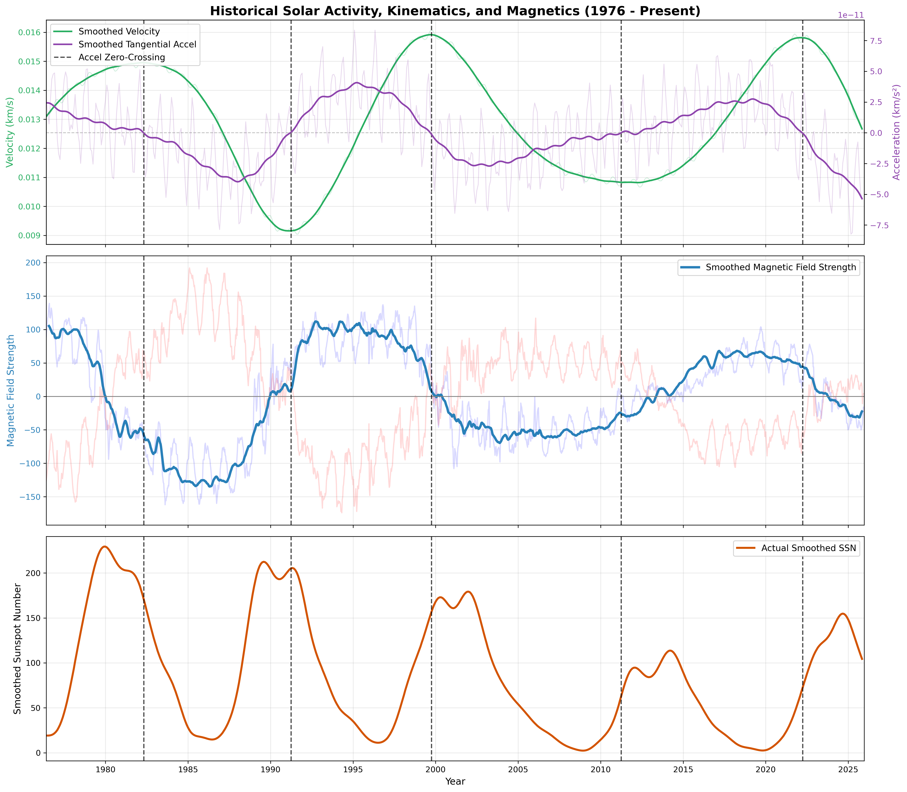
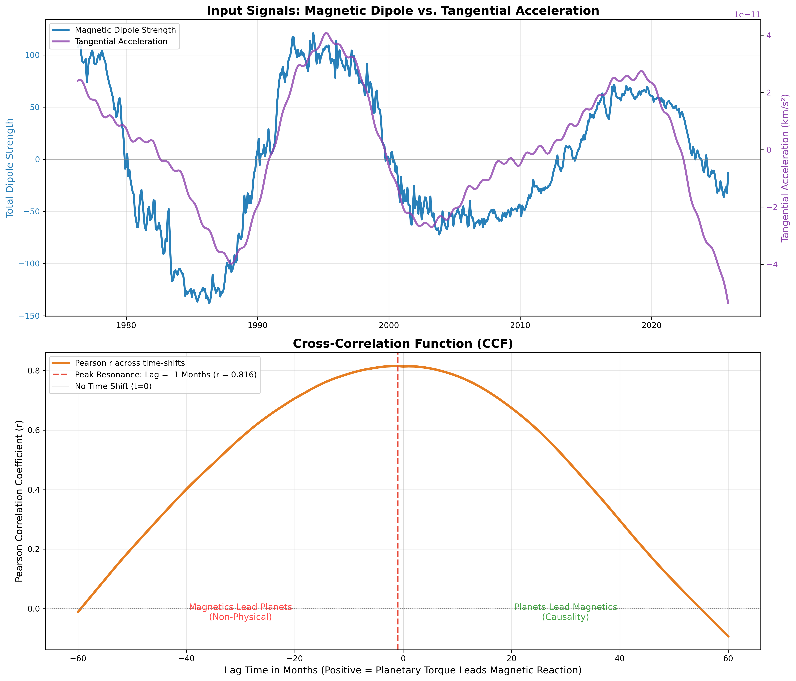
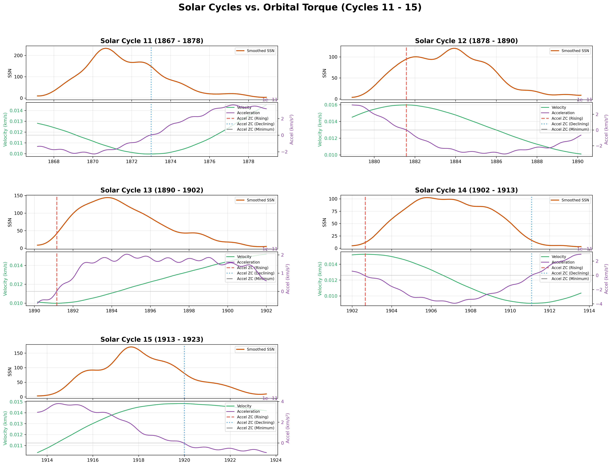
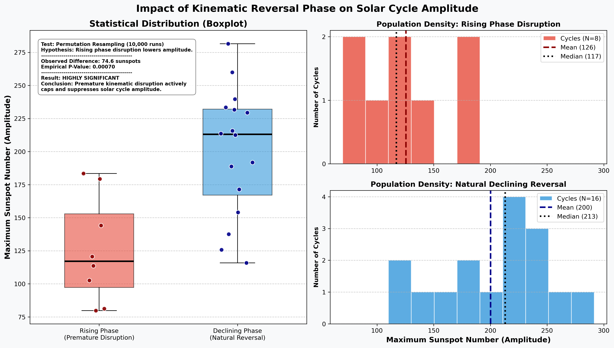
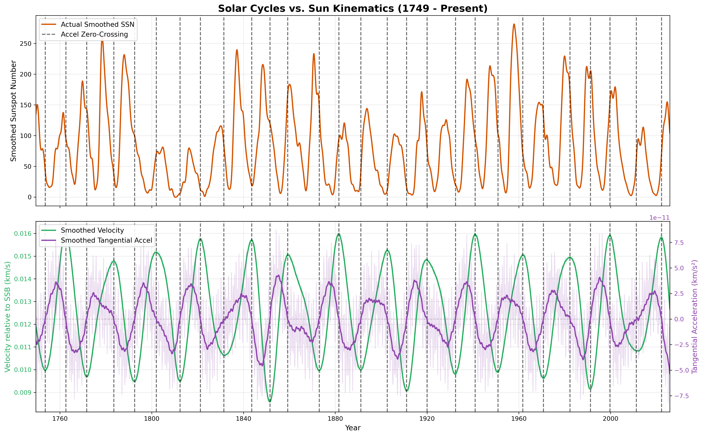
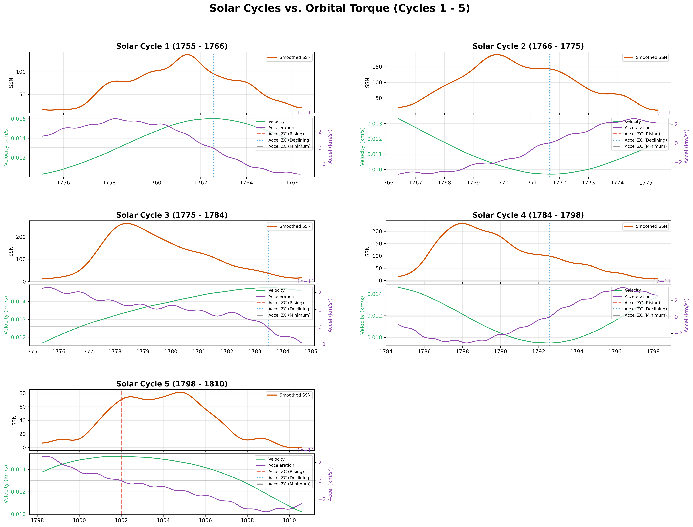
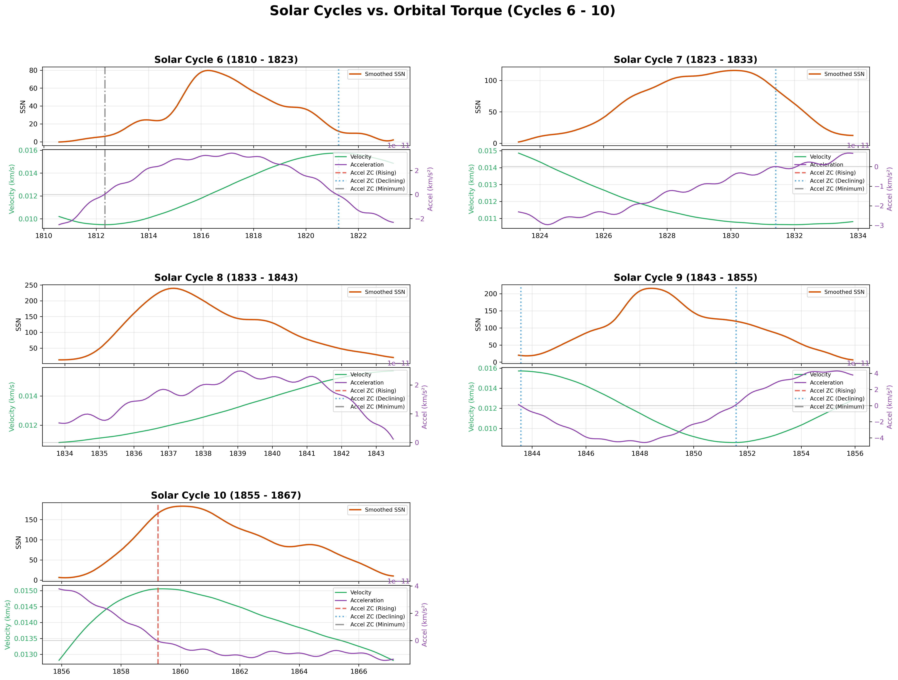
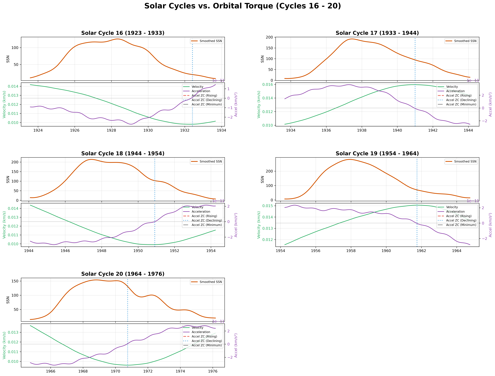
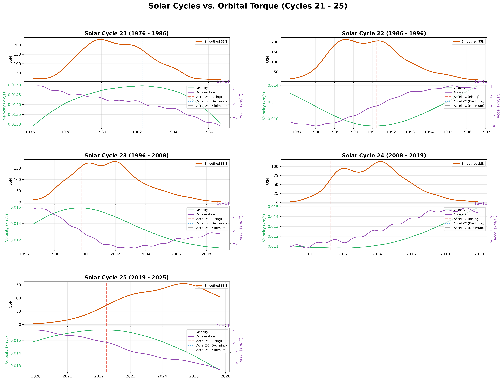
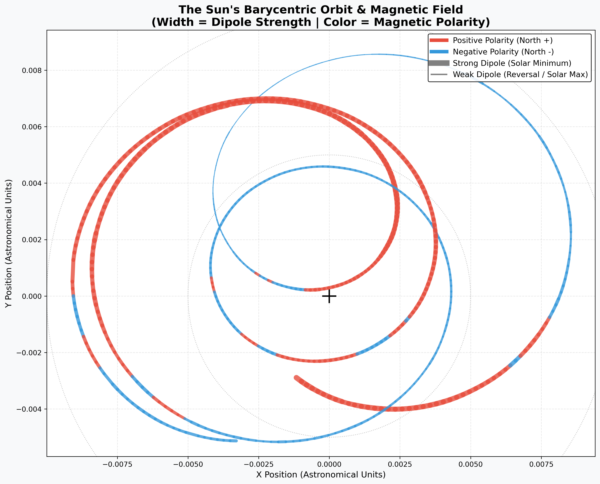

# Solar Kinematic Torque Model: Multivariate Analysis Pipeline

[](https://www.python.org/downloads/)
[](https://opensource.org/licenses/MIT)

**An analysis pipeline demonstrating that planetary-induced orbital torque acts as a "governor" on the solar dynamo.**

## Overview
This repository contains an analysis pipeline designed to investigate the relationships between:
* Tangential acceleration of the Sun (relative to the Barycenter)
* Sun magnetic field (Polar Field Strength)
* Sunspot numbers (Solar Cycle Amplitude)

## Data Sources
* **Sunspot Data:** Historical SIDC/SILSO datasets (Cycles 1 through 24).
* **Kinematic Data:** Computed based on planetary barycentric movement via JPL DE421 ephemerides (`skyfield`).
* **Magnetic Data:** Polar Field Data sourced from the Wilcox Solar Observatory (WSO).




## The Hypothesis & Testing Methodology
**Core Hypothesis:**
1. The Sun's magnetic field correlates with the tangential acceleration of the Sun.
2. The Solar Cycle (Sunspot numbers) is affected when the Sun's magnetic field reverses during the 'Rising Phase' of a solar cycle.
3. The maximum amplitude of that solar cycle gets constructively suppressed when this occurs.

**The Null Hypothesis ($H_0$):**

Planetary gravity is too weak to influence the Sun. Consequently, kinematic zero-crossings occurring during a cycle's Rising Phase will not statistically suppress its maximum amplitude.

**Methodology:**
1. Identify the events when the Sun's tangential acceleration reversed (over the 270 years of available sunspot data).
2. Identify the phase of the solar cycle when these events occurred: Rising, Declining, Minimum.
3. Determine the maximum sunspot number for that solar cycle.
4. Split the solar cycles into 2 groups: cycles with an event during the *Rising Phase*, and all other cycles.
5. Compare the maximum amplitude between these two groups using non-parametric statistical resampling.



**Result:**



* Permutation Test on this result: **empirical P-value of 0.0006 (99.9% confidence)** 
* Conclusion: There is a highly significant relationship between tangential acceleration and the solar cycle amplitude.
* Indirect conclusion: There is a highly significant relationship between tangential acceleration and the Sun Magnetic field.


## Data Sources & Integrity
* **Sunspot Data:** Historical SIDC/SILSO datasets (Cycles 1 through 24): Sunspot data from the World Data Center SILSO, Royal Observatory of Belgium, Brussels, https://doi.org/10.24414/qnza-ac80
* **Kinematic Data:** Computed based on planetary barycentric movement via JPL DE421 ephemerides (`skyfield`).
* **Magnetic Data:** Polar Field Data sourced from the Wilcox Solar Observatory (WSO): http://wso.stanford.edu/Polar.html (covers 1976-2025)
* **Temporal Scope:** Analysis covers 1755–2025. Data after 2025 is deliberately excluded to ensure statistical integrity against provisional/uncalibrated telemetry during the current polar reversal.

## Repository Structure
* `correlate_sunspots_velocity_magnetism_documented.py`: The core multivariate engine.
* `environment.yml`: Conda dependencies for reproducible environments.
* `historic_kinematic_reversals.md`: Auto-generated log of historical cycles and permutation tests.
* `coherence_results.md`: Auto-generated Fourier resonance analysis.

## Installation & Usage
**Prerequisites:** You must have [Anaconda](https://www.anaconda.com/) or [Miniconda](https://docs.conda.io/en/latest/miniconda.html) installed.

1. **Clone the repository:**
   ```bash
   git clone [https://github.com/yourusername/d.git](https://github.com/yourusername/Solar-Kinematic-Torque-Model.git)
   cd Solar-Kinematic-Torque-Model
   ```

2. **Set up the virtual environment (recommended):**
   ```bash
    conda env create -f environment.yml
   ```
   *This will automatically install Python 3.10 and all required scientific libraries (pandas, numpy, scipy, matplotlib, skyfield, drms).*
3. **Activate the environment:**
   ```bash
    conda activate solar-env
   ```

4. **Run the Analysis Pipeline:**
   ```bash
    python correlate_sunspots_velocity_magnetism_documented.py
   ```
   *Note: This will generate several high-resolution PNG plots and update the Markdown data tables in your local directory.*

## Technical Appendices

Solar Kinematic and Solar Cycle Data 1755–2025:









Sun Barycentric Orbit and magnetic field 1976-2025:



For a complete breakdown of the 270-year historical dataset, including the exact phase classification for each cycle and the permutation test results, please see the full data log:

📄 **[Historic Solar Cycle Kinematic Summary](historic_kinematic_reversals.md)**

Other correlations between Tangential Acceleration and Magnetic field:

📄 **[Coherence results](coherence_results.md)**


## Future work
The model is currently configured to exclude post-2025 provisional data to preserve analytical rigor. Once international observatories finalize the magnetic data for the ongoing Cycle 25 polar reversal (expected late 2026/2027), the pipeline can be rerun to test the predictive power of the model on out-of-sample data.